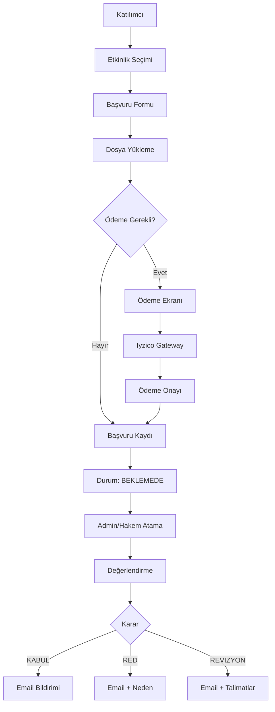
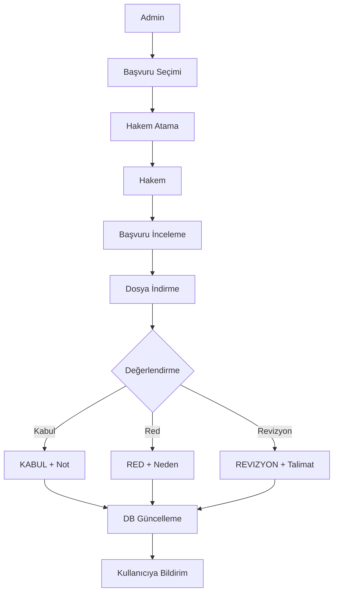

# Kongre Yönetim Sistemi - Teknik Dokümantasyon

## İçindekiler
1. [Sistem Mimarisi](#sistem-mimarisi)
2. [Veritabanı Yapısı](#veritabanı-yapısı)
3. [Kullanıcı Rolleri](#kullanıcı-rolleri)
4. [API Endpoints](#api-endpoints)
5. [Sayfa Yapısı](#sayfa-yapısı)
6. [İş Akışları](#iş-akışları)
7. [Güvenlik](#güvenlik)
8. [Deployment](#deployment)

---

## Sistem Mimarisi

### Teknoloji Stack
- **Framework**: Next.js 14.2.35 (App Router)
- **Veritabanı**: SQLite (Prisma ORM)
- **Kimlik Doğrulama**: NextAuth.js v4
- **Şifreleme**: bcryptjs
- **UI**: Tailwind CSS
- **Icons**: Lucide React

### Proje Yapısı
```
/kongreai
├── app/                    # Next.js App Router
│   ├── api/               # API Routes
│   │   ├── auth/          # Kimlik doğrulama
│   │   ├── user/          # Kullanıcı işlemleri
│   │   └── admin/         # Admin işlemleri
│   ├── dashboard/         # Kullanıcı paneli
│   ├── admin/             # Admin paneli
│   ├── auth/              # Kayıt/Giriş sayfaları
│   └── lib/               # Utility fonksiyonlar
├── components/            # React componentleri
├── prisma/               # Database schema ve migrations
│   ├── schema.prisma     # Veritabanı şeması
│   └── seed.ts           # Seed data
└── public/               # Statik dosyalar
```

---

## Veritabanı Yapısı

### User (Kullanıcı)
Sistem kullanıcılarını saklar.

**Alanlar:**
- `id`: UUID, Primary Key
- `email`: String, Unique - Kullanıcı e-posta adresi
- `password`: String - Bcrypt hashlenmiş şifre
- `ad`: String - Kullanıcı adı
- `soyad`: String - Kullanıcı soyadı
- `role`: String - Kullanıcı rolü (SUPER_ADMIN, ADMIN, ORGANIZATOR, HAKEM, KATILIMCI)
- `unvan`: String? - Akademik unvan (Dr., Prof. Dr., vb.)
- `kurum`: String? - Çalıştığı kurum
- `telefon`: String? - İletişim telefonu
- `aktif`: Boolean - Hesap aktiflik durumu
- `email_verified`: Boolean - E-posta doğrulama durumu
- `ilk_giris`: Boolean - İlk giriş yapıp yapmadığı
- `son_giris_tarihi`: DateTime? - Son giriş zamanı

**İlişkiler:**
- applications: Application[] - Kullanıcının başvuruları
- accommodations: Accommodation[] - Konaklama rezervasyonları

### Event (Etkinlik)
Kongre ve etkinlikleri saklar.

**Alanlar:**
- `id`: UUID, Primary Key
- `slug`: String, Unique - URL dostu benzersiz kimlik
- `baslik`: String - Etkinlik başlığı
- `aciklama`: String - Detaylı açıklama
- `tip`: String - Etkinlik tipi (KONGRE, SEMPOZYUM, KONFERANS, WORKSHOP)
- `baslangic_tarihi`: DateTime - Başlangıç tarihi
- `bitis_tarihi`: DateTime - Bitiş tarihi
- `konum`: String - Etkinlik konumu
- `katilim_ucreti`: Float - Katılım ücreti
- `para_birimi`: String - Para birimi (TRY, USD, EUR)
- `basvuru_aktif`: Boolean - Başvuru kabul edilip edilmediği
- `son_basvuru_tarihi`: DateTime - Son başvuru tarihi
- `durum`: String - Etkinlik durumu (TASLAK, YAYINDA, TAMAMLANDI, IPTAL)

**İlişkiler:**
- applications: Application[] - Etkinliğe yapılan başvurular
- accommodations: Accommodation[] - Etkinlik konaklama seçenekleri
- announcements: Announcement[] - Etkinlik duyuruları

### Application (Başvuru)
Etkinliklere yapılan bilimsel çalışma başvurularını saklar.

**Alanlar:**
- `id`: UUID, Primary Key
- `user_id`: String - Başvuran kullanıcı ID'si
- `event_id`: String - Etkinlik ID'si
- `tip`: String - Başvuru tipi (SOZLU_BILDIRI, POSTER, KATILIMCI)
- `baslik`: String? - Bildiri/poster başlığı
- `ozet`: String? - Bildiri özeti
- `anahtar_kelimeler`: String? - Anahtar kelimeler
- `dosya_url`: String? - Yüklenen dosya URL'i
- `durum`: String - Başvuru durumu (BEKLEMEDE, HAKEMDE, KABUL, RED, REVIZYON)
- `hakem_notu`: String? - Hakem değerlendirme notu

**İlişkiler:**
- user: User - Başvuran kullanıcı
- event: Event - Başvurulan etkinlik
- payment: Payment? - Ödeme bilgisi

### Payment (Ödeme)
Ödeme işlemlerini saklar.

**Alanlar:**
- `id`: UUID, Primary Key
- `application_id`: String, Unique - Başvuru ID'si
- `tutar`: Float - Ödeme tutarı
- `para_birimi`: String - Para birimi (TRY, USD, EUR)
- `durum`: String - Ödeme durumu (BEKLIYOR, ODENDI, IPTAL, IADE)
- `odeme_yontemi`: String? - Ödeme yöntemi (KREDI_KARTI, HAVALE, IYZICO)
- `odeme_tarihi`: DateTime? - Ödeme yapıldığı tarih
- `islem_no`: String? - Ödeme işlem numarası

**İlişkiler:**
- application: Application - İlgili başvuru

### Accommodation (Konaklama)
Etkinlik konaklama rezervasyonlarını saklar.

**Alanlar:**
- `id`: UUID, Primary Key
- `event_id`: String - Etkinlik ID'si
- `user_id`: String? - Kullanıcı ID'si
- `otel_adi`: String - Otel adı
- `otel_yildiz`: Int? - Otel yıldız sayısı
- `oda_tipi`: String - Oda tipi (TEK, CIFT, SUIT)
- `giris_tarihi`: DateTime - Check-in tarihi
- `cikis_tarihi`: DateTime - Check-out tarihi
- `gece_sayisi`: Int - Konaklama gece sayısı
- `fiyat`: Float - Konaklama ücreti
- `para_birimi`: String - Para birimi
- `durum`: String - Rezervasyon durumu (BEKLEMEDE, ONAYLANDI, IPTAL)
- `rezervasyon_kodu`: String? - Rezervasyon kodu
- `odeme_durumu`: String - Ödeme durumu (BEKLENIYOR, ODENDI, IADE)

**İlişkiler:**
- event: Event - İlgili etkinlik
- user: User? - İlgili kullanıcı

### Announcement (Duyuru)
Sistem ve etkinlik duyurularını saklar.

**Alanlar:**
- `id`: UUID, Primary Key
- `event_id`: String? - Etkinlik ID'si (null ise genel duyuru)
- `baslik`: String - Duyuru başlığı
- `icerik`: String - Duyuru içeriği
- `tip`: String - Duyuru tipi (BILGI, UYARI, ONEMLI, ACIL)
- `oncelik`: Int - Görüntüleme önceliği (0-10)
- `yayinlandi`: Boolean - Yayın durumu
- `yayin_baslangic`: DateTime? - Yayın başlangıç tarihi
- `yayin_bitis`: DateTime? - Yayın bitiş tarihi

**İlişkiler:**
- event: Event? - İlgili etkinlik (varsa)

---

## Kullanıcı Rolleri

### SUPER_ADMIN (Süper Yönetici)
**Yetkiler:**
- Tüm sistem ayarlarına erişim
- Kullanıcı rolü değiştirme
- Tüm admin panel özelliklerine erişim
- Sistem genelinde tam yetki

### ADMIN (Yönetici)
**Yetkiler:**
- Etkinlik oluşturma, düzenleme, silme
- Kullanıcı yönetimi (rol hariç)
- Başvuru yönetimi
- Ödeme onaylama
- Hakem atama
- Duyuru yönetimi
- İstatistikleri görüntüleme

### ORGANIZATOR (Organizatör)
**Yetkiler:**
- Etkinlik oluşturma ve yönetme
- Kendi etkinliklerine başvuruları görüntüleme
- Kendi etkinliklerine hakem atama
- Kendi etkinlikleri için duyuru yayınlama

### HAKEM (Reviewer)
**Yetkiler:**
- Atanan başvuruları görüntüleme
- Başvuruları değerlendirme
- Hakem notu ekleme
- Başvuru durumunu güncelleme (KABUL, RED, REVIZYON)

### KATILIMCI (Participant)
**Yetkiler:**
- Etkinlikleri görüntüleme
- Başvuru yapma
- Kendi başvurularını görüntüleme
- Profil bilgilerini düzenleme
- Ödeme yapma
- Konaklama rezervasyonu

---

## API Endpoints

### Authentication

#### POST /api/auth/[...nextauth]
NextAuth kimlik doğrulama endpoint'i.

**Örnek Kullanım:**
```javascript
import { signIn } from 'next-auth/react';

await signIn('credentials', {
  email: 'user@example.com',
  password: 'password123',
  redirect: false
});
```

### User Endpoints

#### PUT /api/user/profile
Kullanıcı profil bilgilerini günceller.

**Request Body:**
```json
{
  "ad": "Ahmet",
  "soyad": "Yılmaz",
  "unvan": "Dr.",
  "kurum": "ABC Üniversitesi",
  "telefon": "+90 555 123 45 67"
}
```

**Response:**
```json
{
  "message": "Profil başarıyla güncellendi.",
  "user": {
    "id": "uuid",
    "email": "user@example.com",
    "ad": "Ahmet",
    "soyad": "Yılmaz",
    ...
  }
}
```

#### POST /api/user/change-password
Kullanıcı şifresini değiştirir.

**Request Body:**
```json
{
  "currentPassword": "oldpass123",
  "newPassword": "newpass456"
}
```

**Response:**
```json
{
  "message": "Şifre başarıyla değiştirildi."
}
```

### Admin Endpoints

#### PUT /api/admin/profile
Admin profil bilgilerini günceller (user/profile ile aynı yapıda).

#### POST /api/admin/change-password
Admin şifresini değiştirir (user/change-password ile aynı yapıda).

---

## Sayfa Yapısı

### Public Pages (Herkese Açık)

#### / (Ana Sayfa)
- Etkinlik listesi
- Yaklaşan kongreler
- Genel bilgilendirme

#### /hakkimizda
- Platform hakkında bilgi
- Misyon ve vizyon
- İletişim bilgileri

#### /gizlilik-politikasi
- KVKK uyumlu gizlilik politikası
- Veri kullanım şartları
- Kullanıcı hakları

#### /events/[slug]
- Etkinlik detay sayfası
- Başvuru formu
- Konaklama seçenekleri
- Etkinlik duyuruları

### Authentication Pages

#### /login
- Kullanıcı girişi
- Email + Password
- "Beni Hatırla" seçeneği

#### /auth/register
- Yeni kullanıcı kaydı
- Email doğrulama
- Profil bilgileri

#### /admin/login
- Admin/Hakem girişi
- Ayrı giriş ekranı
- Rol validasyonu

### User Dashboard

#### /dashboard
- Kullanıcı ana paneli
- Başvuru istatistikleri
- Hızlı işlemler
- Aktif etkinlikler

#### /dashboard/profile
- Profil bilgileri düzenleme
- Şifre değiştirme
- Hesap ayarları

#### /dashboard/applications
- Tüm başvurular listesi
- Durum filtreleme
- Başvuru detayları

#### /dashboard/applications/[id]
- Başvuru detay sayfası
- Hakem notları
- Ödeme bilgisi

### Admin Panel

#### /admin
- Admin ana paneli
- Sistem istatistikleri
- Hızlı erişim kartları
- Son başvurular

#### /admin/profile
- Admin profil yönetimi
- Rol görüntüleme
- Şifre değiştirme

#### /admin/events
- Etkinlik listesi
- Oluşturma/Düzenleme
- Durum yönetimi

#### /admin/applications
- Tüm başvuruları görüntüleme
- Hakem atama
- Durum güncelleme

#### /admin/users
- Kullanıcı yönetimi
- Rol atama
- Hesap aktivasyon

#### /admin/payments
- Ödeme listesi
- Onaylama işlemleri
- Ödeme raporları

---

## İş Akışları

### Kullanıcı Kayıt ve Giriş
```mermaid
graph TD
    A[Kullanıcı] --> B[/auth/register]
    B --> C{Email Benzersiz?}
    C -->|Evet| D[Şifre Hash]
    D --> E[DB'ye Kaydet]
    E --> F[Email Doğrulama]
    F --> G[/login]
    C -->|Hayır| H[Hata: Email Kullanımda]
```

### Başvuru Süreci


### Hakem Değerlendirme


---

## Güvenlik

### Şifre Güvenliği
- **Hash Algoritması**: bcrypt
- **Salt Rounds**: 12
- **Minimum Uzunluk**: 6 karakter
- **Depolama**: Hash olarak, plain text asla saklanmaz

### Session Yönetimi
- **Strategy**: JWT (JSON Web Token)
- **Max Age**: 30 gün
- **Auto Refresh**: Session update trigger ile otomatik yenilenir
- **Secure**: Production'da HTTPS zorunlu

### API Güvenliği
- **Authentication**: NextAuth session kontrolü
- **Authorization**: Rol bazlı erişim kontrolü
- **CSRF Protection**: NextAuth built-in koruması
- **Rate Limiting**: İleride eklenecek

### Veritabanı Güvenliği
- **SQL Injection**: Prisma ORM otomatik koruması
- **Encryption at Rest**: Önerilir (production)
- **Backup**: Düzenli otomatik yedekleme
- **Access Control**: Rol bazlı veri erişimi

### File Upload Güvenliği
- **File Type Validation**: MIME type kontrolü
- **Size Limit**: Maksimum dosya boyutu kontrolü
- **Virus Scan**: Önerilir (production)
- **Secure Storage**: S3/Cloud storage önerilir

---

## Deployment

### Gereksinimler
- Node.js 18+
- npm veya yarn
- SQLite (development)
- PostgreSQL (production önerilir)

### Environment Variables
```bash
# Database
DATABASE_URL="file:./dev.db"

# NextAuth
NEXTAUTH_SECRET="your-secret-key-here"
NEXTAUTH_URL="http://localhost:3000"

# Optional
IYZICO_API_KEY="your-iyzico-key"
IYZICO_SECRET_KEY="your-iyzico-secret"
```

### Build ve Start
```bash
# Dependencies
npm install

# Database
npx prisma generate
npx prisma migrate deploy
npm run seed

# Build
npm run build

# Start
npm start
```

### Production Checklist
- [ ] Environment variables ayarlandı
- [ ] Database migration çalıştırıldı
- [ ] SSL/HTTPS aktif
- [ ] NEXTAUTH_SECRET production değeri
- [ ] Email servisi konfigüre edildi
- [ ] Payment gateway test edildi
- [ ] Backup stratejisi oluşturuldu
- [ ] Monitoring ve logging aktif
- [ ] Rate limiting eklendi
- [ ] CDN için static assets optimize edildi

---

## Performans Optimizasyonu

### Database
- Index'ler: email, slug, user_id, event_id
- Query optimization: Prisma select ve include kullanımı
- Connection pooling

### Caching
- Next.js automatic static optimization
- ISR (Incremental Static Regeneration) etkinlik listesi için
- CDN caching public assets için

### Code Splitting
- Next.js automatic code splitting
- Dynamic imports ağır componentler için
- Lazy loading images

---

## Gelecek Özellikler

### Planlanan
- [ ] Email notification sistemi
- [ ] SMS bildirimleri
- [ ] Çoklu dil desteği (i18n)
- [ ] Gelişmiş raporlama
- [ ] Export functionality (PDF, Excel)
- [ ] Mobil uygulama (React Native)
- [ ] Real-time notifications (WebSocket)
- [ ] Advanced search ve filtering
- [ ] Dashboard analytics
- [ ] Automated testing (Jest, Cypress)

---

## Destek ve İletişim

**Email**: destek@kongreai.com
**Dokümantasyon**: [GitHub Wiki](#)
**Issue Tracking**: [GitHub Issues](#)

---

*Son Güncelleme: 2025-12-27*
*Versiyon: 1.0.0*
